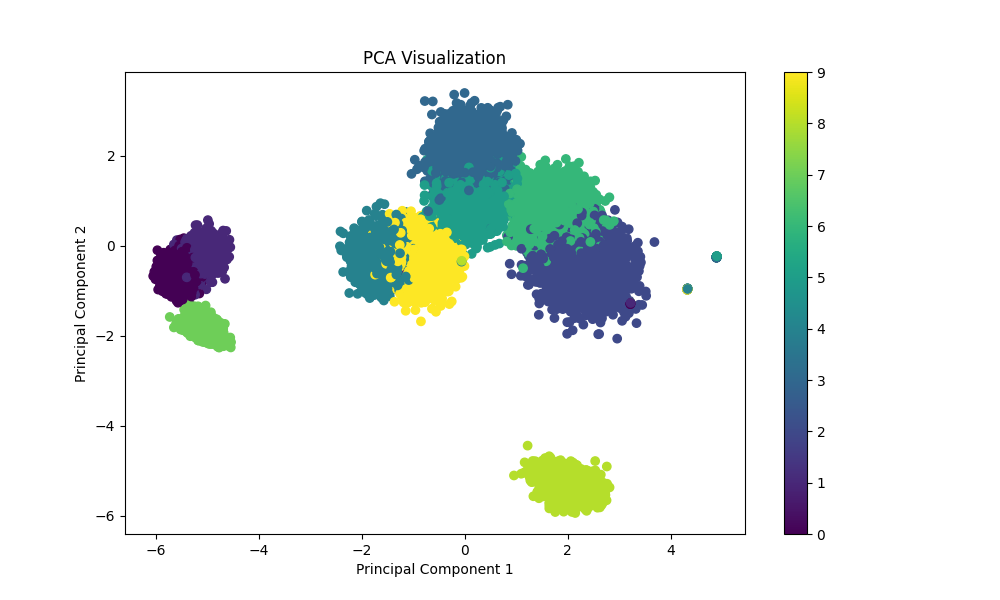
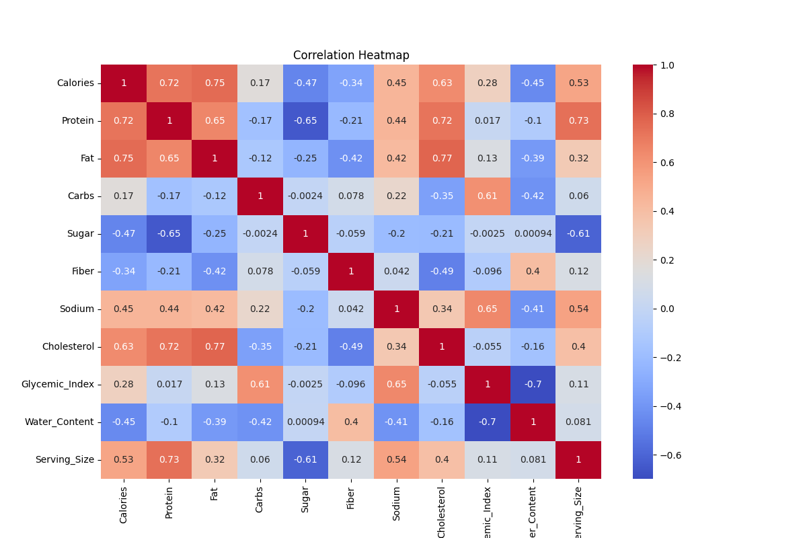
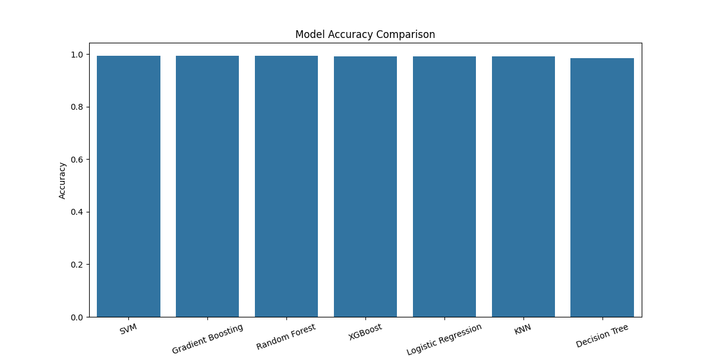
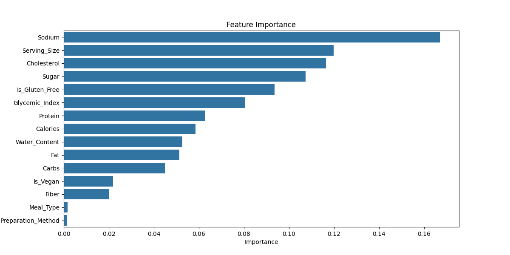

# 🍎 NutriClass Project
### Food Classification Using Nutritional Data and Machine Learning

---

# 📌 Project Overview

NutriClass is a Machine Learning project that classifies different food categories using nutritional information such as calories, protein, fat, carbohydrates, sugar, fiber, sodium, cholesterol, glycemic index, water content, and serving size.

This project demonstrates a complete end-to-end Machine Learning workflow including:

- Data preprocessing
- Missing value handling
- Exploratory Data Analysis (EDA)
- Outlier treatment
- Feature scaling
- PCA visualization
- Training multiple ML models
- Model evaluation
- Cross-validation
- Feature importance analysis
- Model saving

The objective of the project is to accurately classify food categories based on nutritional attributes.

---

# 🚀 Technologies Used

- Python
- Pandas
- NumPy
- Matplotlib
- Seaborn
- Scikit-learn
- XGBoost
- Jupyter Notebook

---

# 📂 Project Structure

```bash
NutriClass_Project/
│
├── data/
│   └── synthetic_food_dataset_imbalanced.csv
│
├── notebooks/
│   └── NutriClass_Project.ipynb
│
├── outputs/
│   ├── models/
│   │   └── svm_model.pkl
│   │
│   ├── plots/
│   │   ├── pca_visualization.png
│   │   ├── correlation_heatmap.png
│   │   ├── model_accuracy_comparison.png
│   │   └── feature_importance.png
│   │
│   └── reports/
│       └── NutriClass_Project.pdf
│
├── README.md
├── requirements.txt
└── .gitignore
```

---

# 📊 Dataset Information

The dataset contains nutritional attributes of multiple food items.

## Features Used

- Calories
- Protein
- Fat
- Carbs
- Sugar
- Fiber
- Sodium
- Cholesterol
- Glycemic_Index
- Water_Content
- Serving_Size
- Meal_Type
- Preparation_Method
- Is_Vegan
- Is_Gluten_Free

## Target Variable

- Food_Name

---

# 🧹 Data Preprocessing

The following preprocessing steps were performed:

✅ Missing value handling using median imputation  
✅ Duplicate row removal  
✅ Label encoding for categorical variables  
✅ Boolean feature conversion  
✅ Feature scaling using StandardScaler  
✅ Outlier treatment using IQR method  

---

# 📈 Exploratory Data Analysis

EDA techniques used:

- Food category distribution analysis
- Histograms for numerical columns
- Correlation heatmap
- Boxplots for outlier detection

---

# 🤖 Machine Learning Models Used

The following models were trained and evaluated:

- Logistic Regression
- Decision Tree Classifier
- Random Forest Classifier
- K-Nearest Neighbors (KNN)
- Support Vector Machine (SVM)
- XGBoost Classifier
- Gradient Boosting Classifier

---

# 🏆 Best Performing Model

## ✅ Support Vector Machine (SVM)

### Performance Metrics

| Metric | Score |
|---|---|
| Accuracy | 99.42% |
| Precision | 99.43% |
| Recall | 99.42% |
| F1 Score | 99.42% |

Cross-validation was also performed to ensure model robustness.

---

# 📷 Visualizations

## 📌 PCA Visualization



---

## 📌 Correlation Heatmap



---

## 📌 Model Accuracy Comparison



---

## 📌 Feature Importance



---

# 🔍 Feature Importance Insights

The most influential features for food classification were:

- Sodium
- Serving_Size
- Cholesterol
- Sugar
- Glycemic_Index

These features significantly contributed to model performance.

---

# 💾 Model Saving

The final trained SVM model was saved using Pickle format.

```python
import pickle

pickle.dump(final_model, open('svm_model.pkl', 'wb'))
```

---

# ▶️ How to Run the Project

## 1️⃣ Clone the Repository

```bash
git clone https://github.com/rajdeepsen97/NutriClass_Project.git
```

---

## 2️⃣ Navigate to Project Directory

```bash
cd NutriClass_Project
```

---

## 3️⃣ Install Dependencies

```bash
pip install -r requirements.txt
```

---

## 4️⃣ Launch Jupyter Notebook

```bash
jupyter notebook
```

---

# 📌 Future Improvements

- Deep Learning implementation
- Deployment using Flask or Streamlit
- Real-world food dataset integration
- Nutritional recommendation system
- Mobile/Web application integration

---

# 📄 Project Report

Detailed project report is available in:

```bash
outputs/reports/NutriClass_Project.pdf
```

---

# 👨‍💻 Author

## Rajdeep Sen

Machine Learning & Data Science Enthusiast

---

# ⭐ If you found this project useful, consider giving it a star on GitHub!